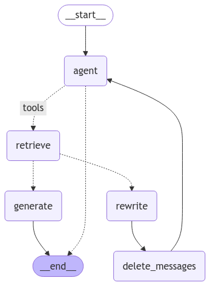

# Multi-agent RAG with LangGraph Workshop

This repository provides the resources and instructions for a hands-on workshop focused on using LangGraph to create and orchestrate a number of agents and respective tooling for them to utilize in order to achieve a task. The workshop is designed to guide participants through the process of building a basic agentic application.

## Prerequisites

Before you begin, ensure you have completed the [prior workshops](../README.md). In general, you should have the following already:
- **Azure OpenAI Resource**: Need to also have the endpoint URL and API get ready.
- **GPT-4o Model Deployed**: In the Azure OpenAI resource, deploy the latest GPT-4o model with standard deployment. Not the deployment name as you'll need it later.
- **VS Code**: Install Visual Studio Code.
- **GitHub Repo**: Clone the [ai-gbb-learning-shop](https://github.com/rashedtalukder/ai-gbb-learning-shop) repository from GitHub.
- **Environment**: Initiate command prompt/terminal/powershell in VS Code and set up a temporary coding environment with conda (`conda activate ai-gbb-workshop`).

### Install Python Dependencies
Install required libraries as listed in the **requirements.txt**. The libraries here provide accelerated development by reusing code.

1. With the repository open in VSCode, and from within the terminal/command prompt window in VSCode, navigate to the **agentic_rag** directory.
2. Making sure that your conda environment is active first, enter the the following to read the contents of requirements.txt and install using the pip package mangement tool for Python:
```
pip install -r requirements.txt
```

## Executing the Agentic Application
### What we're building

We have a main agent that takes a user query related to Lilian Weng's work on LLMs. There are tools that are available to use to answer the question and also mechanisms to rewrite the user question to provide a better answer based on available content. It also showcases how history state can be modified in order to improve response quality.

The tool **retrieve** has content from external sources that is stored as a vector store and has metadata to describe it's capabilities.

If needed, rewrite agent will rewrite the user prompt to be more aligned with the purpose of this application and available content, if possible, so that documents can be retrieved.

### Run in Jupyter Notebook
1. Go to the **agentic_rag.ipynb** file
2. Use the conda virtual environment you created by pressing **CTRL**+**SHIFT**+**P**. In the pop-up search for `Python: Select Interpreter` and navigate to conda environments and use the `ai-gbb-workshop`.
3. Next, hover over the top code block and press the _play_ button that shows up on the top-left edge of that block. It will now prompt you to paste in your Azure OpenAI API key into a pop-up in the top-middle of VS Code. The lecture will contain guidance for what the blocks do and the implemented concepts of a graph-RAG pattern as implemented with the LangGraph framework.

## Conclusion
By the end of this workshop, you now have hands-on experience building and modifying flows in prompt flow, and you know how to evaluate their performance using a testing dataset.